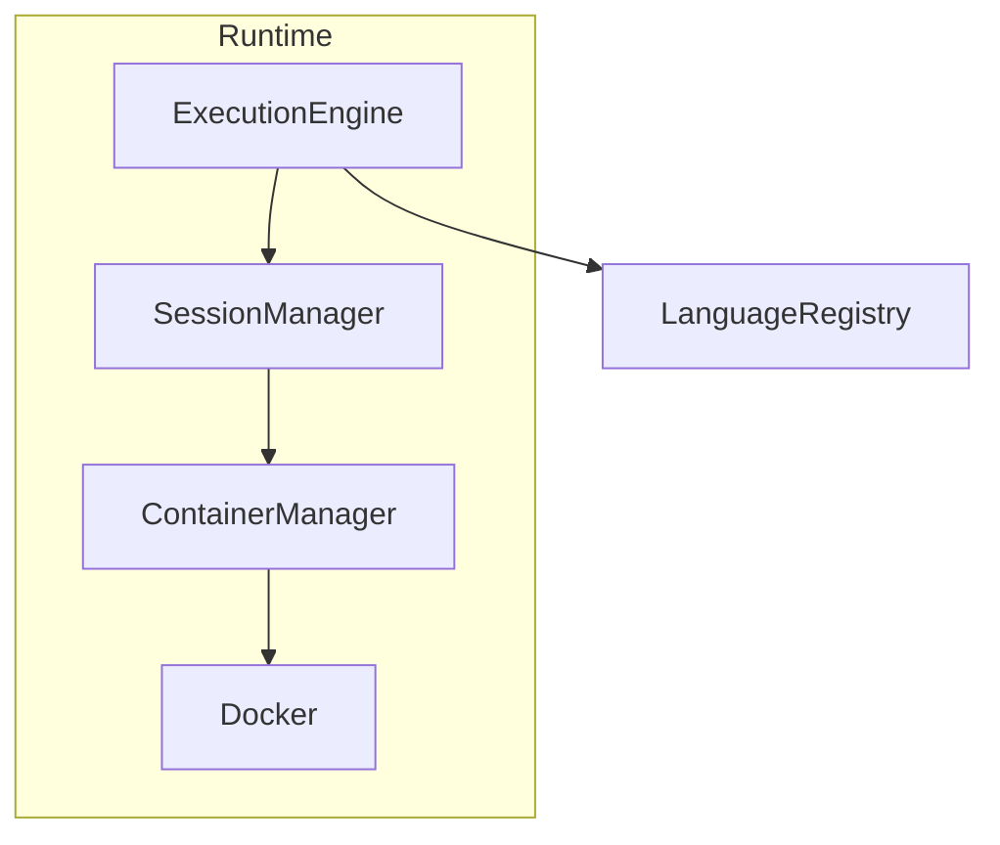

# Interpreter Tools


Run AI-generated code on your own machine—**locally, securely, at lightning speed**.  

**Vercel AI tool** provided out of the box.

Interpreter Tools is a drop-in **"code-interpreter"** backend for AI agents: it spins up **lightweight Docker containers**, executes untrusted snippets in < 100 ms (with pooling), streams the output, and can be **extended to any language** by registering a new config object.

Supports pooling, per-session containers, dependency caching, and real-time stdout/stderr—perfect for chat-based tools like GPT function calling, Jupyter-style notebooks, or autonomous agents that need to evaluate code on the fly.

## Why Interpreter Tools?

⚡ **Sub-100 ms average execution** (with container pool & dep-cache). Run untrusted code fast without leaving Node!

🔌 **Plug-in language architecture** – add a new language by registering one object (see `LanguageRegistry`). No engine edits required.

📦 **Zero-install repeat runs** – dependencies are installed once per container and skipped thereafter, saving seconds on every call.

🔒 **Docker-level isolation** – each snippet executes in its own constrained container (CPU, memory, no-new-privileges).

🖥️ **Real-time streaming** – stdout/stderr stream back instantly; ideal for REPL-like experiences.

---

## Getting Started

### Installation

Interpreter Tools is published on npm as [`interpreter-tools`](https://www.npmjs.com/package/interpreter-tools).

Install the package and its dependencies in your Node.js project:

```bash
# Using yarn
yarn add interpreter-tools ai @ai-sdk/openai

# Or using npm
npm install interpreter-tools ai @ai-sdk/openai
```

### Quick Start

1. Create a new file `example.js` in your project:

```javascript
const { generateText } = require('ai');
const { openai } = require('@ai-sdk/openai');
const { createCodeExecutionTool } = require('interpreter-tools');

async function main() {
  try {
    // Create a code execution tool instance
    const { codeExecutionTool } = createCodeExecutionTool();

    // Use generateText with codeExecutionTool to generate and execute code
    const result = await generateText({
      model: openai('gpt-4'),
      maxSteps: 10,
      messages: [
        {
          role: 'user',
          content: 'Write a JavaScript function that calculates the sum of numbers from 1 to n and print the result for n=10. Make sure to include a test case.'
        }
      ],
      tools: { codeExecutionTool },
      toolChoice: 'auto'
    });

    console.log('AI Response:', result.text);
    console.log('Execution Results:', result.toolResults);

  } catch (error) {
    console.error('Error:', error);
  }
}

main();
```

2. Set up your OpenAI API key:

```bash
# Using yarn
yarn add dotenv

# Or using npm
npm install dotenv
```

Create a `.env` file in your project root:
```env
OPENAI_API_KEY=your_api_key_here
```

3. Update your code to use the environment variable:

```javascript
require('dotenv').config();
// ... rest of the code remains the same
```

4. Run the example:

```bash
node example.js
```

### Direct ExecutionEngine Usage

If you prefer to use the ExecutionEngine directly without the AI integration, here's how to do it:

1. Create a new file `direct-example.js`:

```javascript
const { ExecutionEngine, ContainerStrategy } = require('interpreter-tools');

async function main() {
  const engine = new ExecutionEngine();

  try {
    // Create a session with per-execution strategy
    const sessionId = await engine.createSession({
      strategy: ContainerStrategy.PER_EXECUTION,
      containerConfig: {
        image: 'node:18-alpine',
        environment: {
          NODE_ENV: 'development'
        }
      }
    });

    // Execute JavaScript code
    const result = await engine.executeCode(sessionId, {
      language: 'javascript',
      code: `
const numbers = [1, 2, 3, 4, 5];
const sum = numbers.reduce((a, b) => a + b, 0);
const average = sum / numbers.length;

console.log('Numbers:', numbers);
console.log('Sum:', sum);
console.log('Average:', average);
      `,
      streamOutput: {
        stdout: (data) => console.log('Container output:', data),
        stderr: (data) => console.error('Container error:', data)
      }
    });

    console.log('Execution Result:');
    console.log('STDOUT:', result.stdout);
    console.log('STDERR:', result.stderr);
    console.log('Exit Code:', result.exitCode);
    console.log('Execution Time:', result.executionTime, 'ms');

  } catch (error) {
    console.error('Error:', error);
  } finally {
    // Clean up resources
    await engine.cleanup();
  }
}

main();
```

2. Run the example:

```bash
node direct-example.js
```

This example demonstrates:
- Creating a session with a specific container strategy
- Configuring the container environment
- Executing code directly in the container
- Handling real-time output streaming
- Proper resource cleanup

### TypeScript Support

If you're using TypeScript, you can import the packages with type definitions:

```typescript
import { generateText } from 'ai';
import { openai } from '@ai-sdk/openai';
import { createCodeExecutionTool } from 'interpreter-tools';
import 'dotenv/config';

// Rest of the code remains the same
```

## Extending with New Languages (Ruby Example)

Interpreter Tools can support any language that has a runnable Docker image—just register a `LanguageConfig` at runtime.

```typescript
import { LanguageRegistry, LanguageConfig } from 'interpreter-tools';

const rubyConfig: LanguageConfig = {
  language: 'ruby',
  defaultImage: 'ruby:3.2-alpine',
  codeFilename: 'code.rb',
  prepareFiles: (options, dir) => {
    const fs = require('fs');
    const path = require('path');
    fs.writeFileSync(path.join(dir, 'code.rb'), options.code);
  },
  buildInlineCommand: () => ['sh', '-c', 'ruby code.rb'],
  buildRunAppCommand: (entry) => ['sh', '-c', `ruby ${entry}`]
};

// Make the engine aware of Ruby
LanguageRegistry.register(rubyConfig);

// From this point you can use `language: 'ruby'` in `executeCode` or the AI tool.
```

See [`examples/ruby-example.ts`](./examples/ruby-example.ts) for a full working script that:

- Registers Ruby support on-the-fly
- Asks the AI model to generate a Ruby script
- Executes the script inside a `ruby:3.2-alpine` container

## Local Development

To set up the project for local development:

```bash
# Clone the repository
git clone https://github.com/CatchTheTornado/interpreter-tools.git
cd interpreter-tools

# Install dependencies
yarn install
```

## Examples

The `/examples` directory contains several example scripts demonstrating different use cases of the interpreter tools:

### AI Tool Example
[`examples/ai-example.ts`](./examples/ai-example.ts)
Demonstrates how to:
- Use the code execution tool with Vercel AI
- Generate and execute Python code using AI
- Handle AI-generated code execution results
- Process Fibonacci sequence calculation

Run it with:
```bash
yarn ts-node examples/ai-example.ts
```

### Basic Usage Example
[`examples/basic-usage.ts`](./examples/basic-usage.ts)
Shows how to:
- Set up a basic execution environment
- Execute JavaScript code in a container
- Handle execution results and errors
- Use the per-execution container strategy

Run it with:
```bash
yarn ts-node examples/basic-usage.ts
```

### Python Example
[`examples/python-example.ts`](./examples/python-example.ts)
Demonstrates how to:
- Execute Python code in a container
- Handle Python dependencies
- Process Python script output
- Use Python-specific container configuration

Run it with:
```bash
yarn ts-node examples/python-example.ts
```

### Python Chart Example
[`examples/python-chart-example.js`](./examples/python-chart-example.js)
Demonstrates how to:
- Generate files from within a Python script (e.g., PNG charts)
- Persist and retrieve these generated artifacts from the container
- Handle file management workflows when running Python code via the engine

Run it with:
```bash
node examples/python-chart-example.js
```

### Python JSON Sort Example
[`examples/python-json-sort-example.js`](./examples/python-json-sort-example.js)
Demonstrates how to:
- Inject files (in this case JSON) into the container before execution
- Generate additional files inside the container
- Sort and process JSON data using a Python script
- Retrieve the resulting files back to the host

Run it with:
```bash
node examples/python-json-sort-example.js
```

### Shell JSON Processing Example
[`examples/shell-json-example.ts`](./examples/shell-json-example.ts)
Demonstrates how to:
- Generate and execute a shell script using AI
- Create directories and JSON files
- Process JSON files using `jq`
- Handle Alpine Linux package dependencies

Run it with:
```bash
yarn ts-node examples/shell-json-example.ts
```

### Node.js Project Example
[`examples/nodejs-project-example.ts`](./examples/nodejs-project-example.ts)
Shows how to:
- Generate a complete Node.js project structure using AI
- Create an Express server
- Handle project dependencies
- Execute the generated project in a container

Run it with:
```bash
yarn ts-node examples/nodejs-project-example.ts
```

### Shell Example
[`examples/shell-example.ts`](./examples/shell-example.ts)
A simple example that:
- Creates a shell script
- Executes it in an Alpine Linux container
- Demonstrates basic container configuration
- Shows real-time output streaming

Run it with:
```bash
yarn ts-node examples/shell-example.ts
```

### Ruby Example
[`examples/ruby-example.ts`](./examples/ruby-example.ts)
Shows how to:
- Dynamically register Ruby language support
- Use the AI tool to generate and execute Ruby code

Run it with:
```bash
yarn ts-node examples/ruby-example.ts
```

### Benchmark Examples
[`examples/benchmark-pool.ts`](./examples/benchmark-pool.ts) – JavaScript/TypeScript pool benchmark (20 rounds)

```bash
yarn ts-node examples/benchmark-pool.ts
```

[`examples/benchmark-pool-python.ts`](./examples/benchmark-pool-python.ts) – Python pool benchmark

```bash
yarn ts-node examples/benchmark-pool-python.ts
```

Average times on a MacBook M2 Pro: **JS 40 ms / round**, **Python 60 ms / round** after first run (deps cached).

## Interactive Shell Example

The repository includes an interactive shell example that demonstrates how to use the code execution engine in an interactive way. The shell provides a user-friendly interface for executing code and managing containers.

### Features

- Persistent session with shared workspace
- Automatic language selection (shell or Python by default)
- Real-time execution feedback
- Container history tracking
- Special commands:
  - `info` - Display session information and container history
  - `quit` - Exit the shell

### Example Usage

```bash
# Run the interactive shell
yarn ts-node examples/interactive-shell-example.ts
```

Example session:
```bash
=== Interactive AI Shell ===

Workspace Directory: /tmp/it_abc123
Type your commands or AI prompts below.
Special commands:
  - "info" - Show session information and container history
  - "quit" - Exit the shell

> print numbers from 1 to 5
AI Thinking... ✓ AI Response received

Executing in Docker sandbox:
Language: python

Code:
for i in range(1, 6):
    print(i)

Output:
1
2
3
4
5

> create a plot using matplotlib
AI Thinking... ✓ AI Response received

Executing in Docker sandbox:
Language: python
Dependencies: matplotlib

Code:
import matplotlib.pyplot as plt
import numpy as np

x = np.linspace(0, 10, 100)
y = np.sin(x)
plt.plot(x, y)
plt.savefig('plot.png')

Output:

[Generated files: /workspace/plot.png]

> info
=== Session Information ===
Session ID: interactive-abc123
Created: 2024-03-14T12:34:56.789Z
Last Executed: 2024-03-14T12:35:01.234Z
Active: No

Current Container:
- Image: python:3.11-alpine
- Running: No
- Created: 2024-03-14T12:34:56.789Z
- Last Executed: 2024-03-14T12:35:01.234Z

Container History:
Container 1:
- Name: it_abc123
- Image: python:3.11-alpine
- Container ID: abc123def456
- Created: 2024-03-14T12:34:56.789Z
- Last Executed: 2024-03-14T12:35:01.234Z
- Generated Files: 0
```

### Key Features

1. **Shared Workspace**: Files created in one execution are available in subsequent executions
2. **Container Management**: Automatic container creation and cleanup
3. **Language Support**: Automatic language selection based on the task
4. **Dependency Management**: Automatic installation of required packages
5. **Session Information**: Detailed view of container history and session state
6. **Real-time Feedback**: Clear display of execution progress and results

The interactive shell is a great way to experiment with the code execution engine and understand its capabilities.

## Usage

The main components of this project are:

1. `ExecutionEngine`: Manages code execution in containers
2. `SessionManager`: Manages session state, container metadata, and container history across executions
3. `ContainerManager`: Handles Docker container lifecycle
4. `CodeExecutionTool`: Provides a high-level interface for executing code

### Basic Usage

```typescript
import { createCodeExecutionTool } from 'interpreter-tools';

const { codeExecutionTool }  = createCodeExecutionTool();

// Isolated workspace (default)
const result = await codeExecutionTool.execute({
  language: 'javascript',
  code: 'console.log("Hello, World!");',
  streamOutput: {
    stdout: (data) => console.log(data),
    stderr: (data) => console.error(data)
  }
});

// Shared workspace between executions
const result2 = await codeExecutionTool.execute({
  language: 'javascript',
  code: 'console.log("Hello again!");',
  workspaceSharing: 'shared'  // Share workspace between executions
});
```

The `workspaceSharing` option controls how workspaces are managed:
- `isolated` (default): Each execution gets its own workspace
- `shared`: All executions in a session share the same workspace, allowing file persistence between runs

This is particularly useful when you need to:
- Share files between multiple executions
- Maintain state across executions
- Accumulate generated files
- Build up a workspace over multiple steps

## Documentation

### Architecture Overview

Interpreter Tools is composed of four core layers:

| Layer | Responsibility |
|-------|---------------|
| **ExecutionEngine** | High-level façade that orchestrates container lifecycle, dependency caching, and code execution. |
| **SessionManager** | Manages session state, container metadata, and container history across executions. |
| **ContainerManager** | Low-level wrapper around Dockerode that creates, starts, pools, and cleans containers. |
| **LanguageRegistry** | Pluggable store of `LanguageConfig` objects that describe how to build/run code for each language. |

All user-facing helpers (e.g. the `codeExecutionTool` for AI agents) are thin wrappers that forward to `ExecutionEngine`.



---

### Public API

#### `ExecutionEngine`

```typescript
new ExecutionEngine()

createSession(config: SessionConfig): Promise<string>
executeCode(sessionId: string, options: ExecutionOptions): Promise<ExecutionResult>
cleanupSession(sessionId: string): Promise<void>
cleanup(): Promise<void>
getSessionInfo(sessionId: string): Promise<SessionInfo>
```

* **SessionConfig** – chooses a `ContainerStrategy` (`PER_EXECUTION`, `POOL`, `PER_SESSION`) and passes a `containerConfig` (image, env, mounts, limits).
* **ExecutionOptions** – language, code snippet, optional dependencies, stream handlers, etc.
* **ExecutionResult** – `{ stdout, stderr, dependencyStdout, dependencyStderr, exitCode, executionTime }`.  
  `dependencyStdout` and `dependencyStderr` capture any output produced while installing the declared `dependencies` (e.g. `npm`, `pip`, `apk`) _before_ your code starts executing. They are empty when no dependency phase was required.
* **SessionInfo** – comprehensive session information including:
  ```typescript
  interface SessionInfo {
    sessionId: string;
    config: SessionConfig;
    currentContainer: {
      container: Docker.Container | undefined;
      meta: ContainerMeta | undefined;
    };
    containerHistory: ContainerMeta[];
    createdAt: Date;
    lastExecutedAt: Date | null;
    isActive: boolean;
  }
  ```

#### Container Metadata

Each container's state is tracked through the `ContainerMeta` interface:

```typescript
interface ContainerMeta {
  sessionId: string;
  depsInstalled: boolean;
  depsChecksum: string | null;
  baselineFiles: Set<string>;
  workspaceDir: string;
  generatedFiles: Set<string>;
  sessionGeneratedFiles: Set<string>;
  isRunning: boolean;
  createdAt: Date;
  lastExecutedAt: Date | null;
  containerId: string;
  imageName: string;          // docker image tag used
  containerName: string;      // friendly name assigned by ExecutionEngine
}
```

This metadata provides:
- Dependency installation status and checksums
- File tracking (baseline, generated, session-generated)
- Container state (running/stopped)
- Timestamps (creation, last execution)
- Container identification
- Image name of the container
- Human-friendly container name

#### `createCodeExecutionTool()`

Factory that exposes the engine as an [OpenAI function-calling](https://platform.openai.com/docs/guides/function-calling)-friendly tool. It validates parameters with _Zod_ and returns the same `ExecutionResult`.

```typescript
import { createCodeExecutionTool } from 'interpreter-tools';

const { codeExecutionTool } = createCodeExecutionTool();
const { stdout } = await codeExecutionTool.execute({
  language: 'python',
  code: 'print("Hello")'
});
```

#### `LanguageRegistry`

```typescript
LanguageRegistry.get(name): LanguageConfig | undefined
LanguageRegistry.register(config: LanguageConfig): void
LanguageRegistry.names(): string[]
```

`LanguageConfig` fields:

```typescript
interface LanguageConfig {
  language: string;                    // identifier
  defaultImage: string;                // docker image
  codeFilename: string;                // filename inside /workspace for inline code
  prepareFiles(options, dir): void;    // write code + metadata into temp dir
  buildInlineCommand(depsInstalled): string[];
  buildRunAppCommand(entry, depsInstalled): string[];
  installDependencies?(container, options): Promise<void>; // optional pre-exec hook
}
```

---

### Adding a New Language

1. Create a `LanguageConfig` object (see the [Ruby example](#extending-with-new-languages-ruby-example)).
2. Call `LanguageRegistry.register(config)` **once** at startup.
3. Provide a suitable Docker image that has the runtime installed.

No changes to `ExecutionEngine` are required.

---

### Container Strategies

| Strategy | Description | When to use |
|----------|-------------|-------------|
| **PER_EXECUTION** | New container per snippet; removed immediately. | Maximum isolation; slowest. |
| **POOL** | Containers are pooled per session and reused—workspace is wiped between runs. | Best latency / resource trade-off for chat bots. |
| **PER_SESSION** | One dedicated container for the whole session; not pooled. | Long-running interactive notebooks. |

> **Note**
> 
> `ContainerStrategy.POOL` is optimised for fast startup: it re-uses pre-warmed containers and therefore **always clears `/workspace` between executions**.  
> The `workspaceSharing: "shared"` option is *not available* in this mode.  
> If you need persistent state you can either:
> 1. switch to **PER_SESSION** (keeps the internal workspace), or
> 2. mount a host directory via `containerConfig.mounts` to share specific data/files across pooled runs.

---

### Mounts & Environment Variables

`containerConfig` accepts:

```typescript
{
  image?: string;            // overrides language default
  mounts?: ContainerMount[]; // { type: 'directory' | 'tmpfs', source, target }
  environment?: Record<string, string>;
  cpuLimit?: string;         // e.g. '0.5'
  memoryLimit?: string;      // e.g. '512m'
}
```

### Per-Execution Resource Limits

`ExecutionOptions` let you override CPU and memory **for a single run**:

```typescript
await engine.executeCode(id, {
  language: 'python',
  code: 'print(\"hi\")',
  cpuLimit: '0.5',       // half a CPU core
  memoryLimit: '256m'    // 256 MB RAM
});
```

Under the hood the engine calls `container.update({ CpuPeriod, CpuQuota, Memory })` just before execution, so the limits apply even when pooling.

---

### Streaming Output

Pass `streamOutput: { stdout?, stderr?, dependencyStdout?, dependencyStderr? }` in `ExecutionOptions` to receive data chunks in real time while the process runs.

```typescript
await engine.executeCode(id, {
  language: 'shell',
  code: 'for i in 1 2 3; do echo $i; sleep 1; done',
  streamOutput: {
    stdout: (d) => process.stdout.write(d)
  }
});
```

`dependencyStdout` / `dependencyStderr` fire **during the dependency-installation phase** (e.g. when `pip install` or `npm install` runs) _before_ the user code starts. This lets you surface progress logs or errors related to package installation separately from your program's own output.

---

### Injecting Files Into the Workspace

Sometimes your code needs additional assets (datasets, JSON files, images, etc.). There are **two primary ways** to make them available inside the container:

1. **Mount a host directory** – supply a `mounts` array in `containerConfig` when you create a session. This is the easiest way to share many files or large directories.

   ```typescript
   const sessionId = await engine.createSession({
     strategy: ContainerStrategy.PER_EXECUTION,
     containerConfig: {
       image: 'python:3.11-alpine',
       mounts: [
         {
           type: 'directory',                 // always "directory" for now
           source: path.resolve(__dirname, 'assets'), // host path
           target: '/workspace/assets'        // inside the container
         }
       ]
     }
   });
   ```

2. **Programmatically copy / create individual files** – use one of the helper methods that work *after* you have a session:

   ```typescript
   // (a) copy an existing file from the host
   await engine.copyFileIntoWorkspace(sessionId, './input/data.json', 'data.json');

   // (b) create a new file from a base64-encoded string
   await engine.addFileFromBase64(
     sessionId,
     'notes/hello.txt',
     Buffer.from('hi there').toString('base64')
   );
   ```

Both helpers write directly to `/workspace`, so your script can reference the files with just the relative path.

---

### Handling Generated Files

Interpreter Tools automatically tracks new files created in `/workspace` during an execution:

* `ExecutionResult.generatedFiles` – list of absolute paths to the files created in that run.
* `ExecutionResult.workspaceDir` – host path of the temporary workspace directory.

Example:

```typescript
const result = await engine.executeCode(sessionId, {
  language: 'python',
  code: 'with open("report.txt", "w") as f:\n    f.write("done")',
});

console.log('New files:', result.generatedFiles);
```

You can retrieve file contents with:

```typescript
const pngBuffer = await engine.readFileBinary(sessionId, 'charts/plot.png');
fs.writeFileSync('plot.png', pngBuffer);
```

#### Keeping generated files after cleanup

By default, calling `engine.cleanupSession()` or `engine.cleanup()` removes the containers *and* their workspaces. Pass `true` to keep only the files that were detected as generated:

```typescript
await engine.cleanupSession(sessionId, /* keepGenerated = */ true);
```

All non-generated files are removed, the generated ones stay on disk so you can move or process them later. If you mounted a host directory, the files are already on the host and no special flag is needed.

---

Happy hacking! 

## License

MIT 